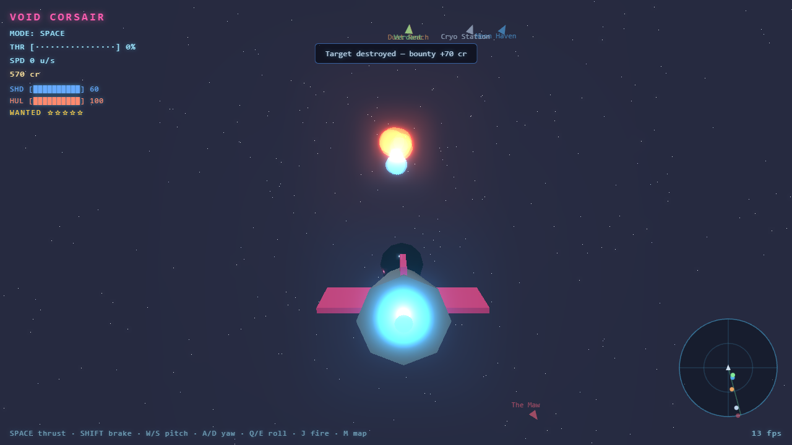

# VOID CORSAIR

A browser 3D **space-pirate** game built with Three.js. Fly your ship between
worlds, land in neon cities, trade and run missions, upgrade your ship, dogfight
bounty hunters, and shoot it out with Enforcers on foot — across a lawless star
cluster.

> *GTA × No Man's Sky × FTL*, stylized and runnable in a browser.



---

## Quick start

You need **Node 18+** and a WebGL2 browser (Chrome/Edge recommended).

```bash
npm install
npm run dev        # then open the localhost URL it prints (e.g. http://localhost:5173)
```

Production build / preview:

```bash
npm run build
npm run preview    # serves the optimized bundle
```

---

## How to play (your first five minutes)

1. **Launch.** On the title screen press **Enter** (or click **NEW GAME**).
2. **Fly.** Hold **Space** to throttle up; steer with **W/S** (pitch) and **A/D**
   (yaw), roll with **Q/E**. Your speed and throttle show top-left; the **radar**
   (bottom-right) shows worlds (colored blips) and hostiles (red) around you.
3. **Pick a destination.** Press **M** for the **star map** and press a number to
   **fast-travel** to a world. You'll arrive at a standoff distance.
4. **Approach & land.** Fly toward the planet until the green **▸ APPROACH** prompt
   appears, then press **F** to land. The screen fades and you're on foot.
5. **Work the city.** Walk with **W/A/S/D**. Three glowing vendors are marked:
   - **Trader** — buy ship **upgrades** (Engine, Shields, Weapons, Cargo, Hull).
   - **Market** — **buy/sell commodities** (see Trading below).
   - **Mission Board** — accept **delivery** and **bounty** contracts.
   Walk up to one and press **E** to interact; press **E** or **Esc** to leave.
6. **Take off.** Return to your ship (the landing pad) and press **T** to launch.
7. **Make money & survive.** Run cargo between worlds, complete contracts, and blast
   raiders for bounties — but watch your **wanted level**.

---

## Controls

| Context | Keys |
|---|---|
| **Title** | `Enter` / click — **NEW GAME** or **CONTINUE** |
| **Flight (SPACE)** | `Space` thrust · `Shift`/`Ctrl` brake · `W`/`S` pitch · `A`/`D` yaw · `Q`/`E` roll |
| **Space combat** | `J` fire lasers (auto-aim lead + light homing) |
| **Navigate** | `M` star map (number keys to fast-travel) · `F` land when the APPROACH prompt shows |
| **On foot (SURFACE)** | `W`/`A`/`S`/`D` walk · `J` blaster · `E` interact at glowing vendors · `T` take off at your ship |
| **Anytime** | `B` bloom on/off · `P` sound on/off · `Esc` close menus *(both settings persist)* |

---

## Reading the HUD

- **Top-left:** mode, throttle bar, speed, **credits**, and in combat your
  **shield (SHD)**, **hull (HUL)**, and **wanted** stars + hostile count.
- **On foot:** the current world + theme, and (in a firefight) your **HP** bar and
  enforcer count.
- **Bottom-right radar:** ship at center, **forward = up**; planet blips are themed
  colors, hostiles are red. Off-range contacts cling to the rim.
- **Center prompts/toasts:** approach/landing/interact hints and event news.

---

## Systems

**The core loop:** Fly → approach a world → land → trade / upgrade / take jobs →
take off → fight or fast-travel → repeat.

- **Trading.** Each world's **Market** prices six commodities differently, and
  prices drift over time with **shortage ▲ / surplus ▼** events (watch the NEWS
  toast on landing). Buy low, haul it — limited by your **Cargo** hold — and sell
  high elsewhere. **Spice** is contraband: high value, flagged illegal.
- **Missions.** **Delivery** jobs pay out when you land at the destination.
  **Bounty** contracts pay out once you've destroyed enough raiders. Up to 4 active.
- **Ship upgrades.** Engine (top speed), Shields, Weapons, Cargo, Hull — bought at
  the Trader; effects apply on your next launch.
- **Space combat.** Lasers with auto-aim lead + light homing. Enemies come in three
  archetypes: fast/fragile **Scouts**, balanced **Raiders**, and slow/tanky
  high-bounty **Gunships**. The mix escalates with your wanted level.
- **Wanted level & on-foot danger.** Kills earn bounties and raise your **wanted
  level**, spawning more and tougher hunters in space. Land somewhere with heat on
  you and **Enforcers** ambush you on foot — draw your blaster (`J`) and fight or
  run for your ship.
- **Saving.** Credits, upgrades, cargo, completed jobs, and settings persist in
  `localStorage`. **CONTINUE** resumes; **NEW GAME** wipes the save.

## Worlds

**Neon Haven** (cyberpunk port) · **Dust Reach** (desert frontier) · **Cryo
Station** (ice labs) · **Verdant** (jungle, high security) · **The Maw** (asteroid
stronghold).

---

## Roadmap

Tracked as GitHub issues — contributions welcome.

**World & visuals**
- [#1 Planetary terrain](https://github.com/jmoore6364/SpacePirates/issues/1) — real low-poly terrain instead of the flat city ground.
- [#2 Lighting & atmosphere](https://github.com/jmoore6364/SpacePirates/issues/2) — per-world lighting, shadows, day/night.

**Navigation & UI**
- [#3 Follow markers / waypoints](https://github.com/jmoore6364/SpacePirates/issues/3) — on-screen markers to targets, vendors, and your ship.
- [#5 World minimap](https://github.com/jmoore6364/SpacePirates/issues/5) — top-down city map while on foot.
- [#6 Space sector / system map](https://github.com/jmoore6364/SpacePirates/issues/6) — spatial cluster overview for route planning.
- [#7 Menu & pause system](https://github.com/jmoore6364/SpacePirates/issues/7) — pause, settings (volume/graphics), save, quit.

**Progression & gameplay**
- [#4 Storylines & quests](https://github.com/jmoore6364/SpacePirates/issues/4) — branching narrative, named NPCs, a campaign.
- [#8 Experience, levels & skill tree](https://github.com/jmoore6364/SpacePirates/issues/8) — XP and perks for piloting/gunnery/trading/engineering.
- [#9 Shipyard — ship variety](https://github.com/jmoore6364/SpacePirates/issues/9) — buy/swap distinct hulls.
- [#10 Fuel & jump-range](https://github.com/jmoore6364/SpacePirates/issues/10) — fuel makes distance and route planning matter.

**Quality of life**
- [#11 Save slots + manual save/load](https://github.com/jmoore6364/SpacePirates/issues/11)
- [#12 Achievements & run stats](https://github.com/jmoore6364/SpacePirates/issues/12)
- [#13 Gamepad support & key remapping](https://github.com/jmoore6364/SpacePirates/issues/13)
- [#14 Tutorial / onboarding](https://github.com/jmoore6364/SpacePirates/issues/14)

See the full [issue tracker](https://github.com/jmoore6364/SpacePirates/issues).

---

## Architecture

Game logic is kept renderer-agnostic behind a thin `Renderer` boundary, so a custom
WebGL engine could be swapped in later (see `docs/ENGINE-ROADMAP.md`).

```
src/
  renderer/   Renderer — the only place Three.js rendering lives (+ bloom, shake)
  core/       GameLoop, GameState (scene state machine), Input, cameras
  scenes/     SpaceScene, SurfaceScene, props, city builder
  entities/   Ship, Character
  systems/    Combat, GroundCombat, Audio (procedural WebAudio)
  game/       Player (economy/upgrades/save), Missions, Market
  ui/         StarMap, Panels (shop/market/missions), TitleScreen
  world/      Worlds (canonical world data)
  util/       math
docs/         DESIGN.md, ENGINE-ROADMAP.md, PACKAGING.md
tests/        logic/ (node:test) + screenshot.mjs (Playwright→Edge self-test)
```

## Testing (no human needed)

```bash
npm test           # logic unit tests + headless screenshot self-test
npm run test:logic # node:test — math, economy, missions, trading
npm run test:shot  # builds, serves, drives the game in headless Edge, screenshots
```

The screenshot harness plays the whole game — title → flight → space combat →
star map → landing → on-foot combat → shop → missions → market → takeoff — saving a
shot of each scene to `test-screenshots/` and failing on any console/WebGL error.
Only *feel* (handling, difficulty, fun) needs a human.

## Status

Core game complete: scaffold, arcade flight, 5 worlds + star-map travel, landing +
on-foot city, economy (upgrades/missions/trading), space **and** on-foot combat,
radar, and juice (bloom, screen shake, procedural audio, title, save/load). Desktop
packaging (Electron → `.exe`/Steam) is optional — see `docs/PACKAGING.md`. Next up:
see the [Roadmap](#roadmap).

## Credits

Built with [Three.js](https://threejs.org/). All art is procedural/low-poly and all
audio is synthesized at runtime — no external assets.
